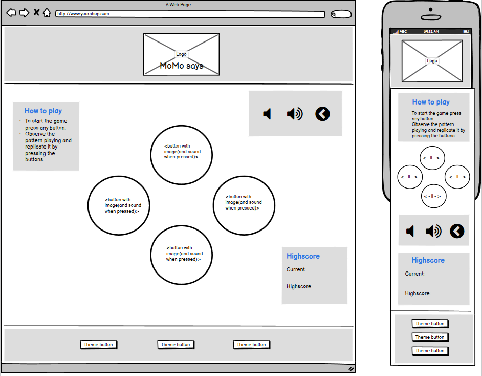
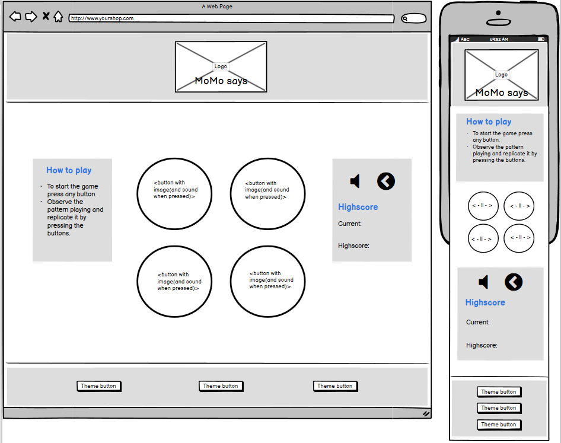

# MoMo Says
Welcome to the MoMo README file.

This is a school project with the main focus to display my skills in HTML, css and javascript. This website's goal is for users and owners to play an animal themed simon says game with three interactive webpage themes.

## UX/UI

### User Stories (UX)
-   As a usertype, I want to play a fun game, to pass my time.

-	As a usertype, the instructions to be simple and easy to understand, so I can play the game easily.

-	As a usertype, to see my current score and my highest score, I that I can compare my own scores.

-	As a usertype, I want to have a restart button, so that I can restart if I want to.

-	As a usertype, I want to have a mute button, so that I can mute audio if I want to.

-	As a usertype, I want there to be a clear structure of the game, so that it does not confuse me.

### Owner Stories (UX)

-   As an ownertype, I want to create a simple yet exiting and responsive game, so that user will want to play more than once.

-   As a ownertype, I want the instructions to be simple and easy for the user to understand, so that they can play easily.

-	As an ownertype, I want to have creative, consistent and interactive features, to appeal to the user which in turn will use the website more.

### Wireframes (UI)

Wireframes for this project was made with [Balsamiq](https://balsamiq.com/).
Before I started programming the webpage the version 1 wireframe was the general interface design aim.
But a few hours into the development process I decided to make minor changes in the interface design
to make the webpage more responsive and user friendly and thus created the version 2 wireframe.
The buttons for lowering and raising the volume was switched to just a mute audio and enable audio button
for the 2 wireframe version.

Wireframe version 1

Wireframe version 2

## Features

### Existing Features
Feature 1 - index.html > (Homepage): allows users to access the full webpage including
the "How to play", MoMo game, highscore and theme buttons.

Feature 2 - index.html > Logo header: interactive MoMo logo that is consistent
throughout the webpage, despite viewport width and theme changes.

Feature 3 - index.html > "How to play": allows users to read clear instructions for
how to play the game and how to win it.

Feature 4 - index.html > MoMo game > start game button: panel with the text "START"
and a font awesome icon of a play button. Allows the user to start the game by pressing
the play button. After pressing the button it disappears and reveals the animal panels.

Feature 5 - index.html > MoMo game: allows the user to play a interactive memory
game with animsl images and animal audio when clicked. 

Feature 6 - index.html > MoMo game > wrong game button: displays a panel with the text
"WRONG", a restart button underneath and plays a Tarzan sound when wrong animal panel is clicked.
When the panel is clicked it restarts the game and current score count. 

Feature 7 - index.html > MoMo game > winner game button: displays a panel with a fontawesome
icon nof a trophy, the text "WINNER", a restart button and plays a Tarzan sound
when wrong animal panel is clicked. When the panel is clicked it restarts the game and
current score count. 

Feature 8 - index.html > Audio button: allows users to turn off and on the
audio. First when the webpage is loaded the button shows that sound is enabled with a fontawesome
icon picturing a megaphone with soundwaves on the right side, it also has a decreased opacity
effect when hovered. When clicked the audio is disabled throughout the webpage and the fontawesome icon
changes to a megaphone with a cross over it. When clicked again the fontawesome icon changes
back to the original and enables audio again.

Feature 9 - index.html > Restart buttons: allows users to restart the game at any time. It also
has a decreased opacity effect when hovered. When pressed it restarts the game and resets the current
score to 0. If the start, wrong or winner panels are covering the animal panels they will disappear
when the restart button is clicked.
hovered

Feature 10 - index.html > Highscore: allows users to see their own score, both
current and highest. The highest score is locally stored so when the webpage is closed
and reopened the highest score is still visible.

Feature 11 - index.html > Theme buttons: three separate buttons allows users to interact with the
interface design of the webpage by switching between three diffrent colored themes. The current or
recently pressed theme is locally stored so when the webpage is refreshed or closed and reopened the
recent theme will be loaded.

### Features Left to Implement
An idea of more features to implement would be to make themes for the animal panels and there for switch
the images of animals and change them to something else. Either cars, plants, other animals or popular 
characters like pokémons, marvel characters or the powerpuff girls. Also change the audio to match the
choosen theme. 

## Technologies Used

### Languages
- HTML
- CSS
- Javascript
    The project is built up on HTML and CSS to make the basic structure of the webpage and to style it.
    Javascript is used to create interactive features like the game, mute button, restart button,
    highscores (current and highest) and three diffrent theme buttons.

### Framework
- Bootstrap
    The project uses Bootstrap to simplify the structural development of the webpages HTML and CSS.
    [getbootstrap.com](https://getbootstrap.com/)

### Library

- jQuery
    The project used the javaScript library jQuery to simplify the construction of the javascript files.
    [jquery.com](https://jquery.com/)

- Fontawesome
    The project used fontawesome icons to make the webpage more intuitive and more visually appealing.
    [fontawesome.com](https://fontawesome.com/)

- w3schools
    The project used w3shools online color picker to easily find and test diffrent colors for the pricing headings.
    [w3schools.com](https://www.w3schools.com/colors/colors_picker.asp)

#### Other Technologies

- Hatchful
    The project uses a logo made with the online tool hatchful. 
    [hatchful](hatchful.shopify.com)

- Favicon
    The project uses a favicon made with the favicon.ico generator tool to make the page more visually appealing.
    The image is a cropped version of the company logo.
    [favicon-generator.org](https://www.favicon-generator.org/)

- Audiotrimmer
    The project used an online audio cutter to shorten the lenght of the audio files used in the MoMo game.
    [audiotrimmer.com](https://audiotrimmer.com/#)

- Balsamiq
    The project used the wireframe Balsamiq to create simple visual wireframes.
    [Balsamiq](https://balsamiq.com/)

- Lunapic
    The project used the online tool to lower opacity of the summer background image.
    [lunapic.com](https://www11.lunapic.com/editor/)

- Tinypng
    The project used the online tool to decrese the size of the background images.
    [tinypng.com](https://tinypng.com/)

## Testing

### Manual Testing
Manual testing:

The manual testing will be executed with the following method: 
Page > action taken > expected result > pass/fail

1. index.html > clicked on start button > start button disappear and game starts > pass
2. index.html > hover over start button > opacity reduces with 0.3 > pass
3. index.html > clicked on start button > start button disappear and game starts > pass
4. index.html > clicked on animal panel > animal panel audio plays with matching audio > pass
5. index.html > clicked on correct animal panel > animal panel audio plays with matching audio and current score increments > pass
6. index.html > clicked on wrong animal panel > Tarzan audio plays and "wrong" button displays > pass
7. index.html > clicked on wrong button > wrong button disappears and game starts > pass
8. index.html > clicked on the right animal panels and recived 10 points > winner button appears > pass
9. index.html > clicked on the winner button > winner button appears and restarts the game > pass
10. index.html > hover over mute audio button > opacity of button reduces by 0.3 > pass
11. index.html > clicked on the mute audio button > fontawesome icon changes to crossed over megaphone and audio is disabled > pass
12. index.html > clicked on the enable audio button > fontawesome icon changes to megaphone with sound waves and audio is enabled > pass
13. index.html > hover over restart button > opacity of button reduces by 0.3 > pass
14. index.html > clicked on the restart button > if start, wrong or winner button is visible it disappears and restarts the game > pass
15. index.html > clicked winter theme button > change color of header, game-section-text and footer. Also change background image to a winter image > pass
16. index.html > clicked galaxy theme button > change color of header, game-section-text and footer. Also change background image to a galaxy image > pass
17. index.html > clicked summer theme button > change color of header, game-section-text and footer. Also change background image to a summer image > pass
18. index.html > clicked winter theme button and refresh webpage > page loads with winter theme > pass 
19. index.html > clicked galaxy theme button and refresh webpage > page loads with galaxy theme > pass 
20. index.html > clicked summer theme button and refresh webpage > page loads with summer theme > pass 
21. index.html > clicked correct animal panel 5 times in a row and refresh page > previous highest score is loaded in highest score > pass

    Repeat all testing on other web browsers to make sure they are compatible with the code.
    Tests have been made on: Mozilla Firefox, Google Chrome and Microsoft Edge.

Webpage when initially loaded

Webpage with mouse over start button (with hover effect)

Webpage with start button pressed

Webpage with animal panel pressed

Webpage with wrong animal panel pressed showing the wrong button

Webpage with winner button showing

Webpage with a refreshed webpage and stored highest score

Webpage with winter theme

Webpage with galaxy theme

    

### Code Testing
- Jasmine testing

### Bugs:
Recived:
"NotAllowedError: The play method is not allowed by the user agent or the platform in the current context, possibly because the user denied permission."
When the site automatically played up the game flash sequence. To fix the problem I added a call to the automatic starting function of sequence to first
be played after one ofe the animal buttons have been clicked. After this was implemented there was no longer a error message.

https://stackoverflow.com/questions/57504122/browser-denying-javascript-play

- Wrong color of logo
When I uploaded the dark MoMo logo the background color was #25161b when swatched before I uploaded it to the page and
afterwards it became slightly lighter, making it visibly stand out from the background color that had the swatched hex color.
To get the later hex color of the logo I needed to do a printscreen of the webpage with the logo uploaded and swatch the color
to recive #2a1c21 and then use that color as my default dark themed hex color.

- NaN in Highest highscore (Had to clear cache)

## Deployment

## Credits

### Content

Grid responsiveness from [Bootstrap](https://getbootstrap.com/docs/4.5/layout/grid/)

Markdown styling from Github guides for [headings](https://guides.github.com/features/mastering-markdown/)

Code about playing audio onclick was adapted from [Arunkumar via stackoverflow](https://stackoverflow.com/questions/18826147/javascript-audio-play-on-click)

<!-- Code about cloning in javascript was adapted from [Luka Kvavilashvili via stackoverflow](https://stackoverflow.com/questions/40822531/jquery-audio-how-to-allow-overlapping-sounds) -->

### Media

#### Images: 

- Image of pig is created by Kimberly Lake and retrived via [unsplashed](https://unsplash.com/photos/VBmRbvMrb7A), thank you Kimberly!

- Image of sealion is created by Duncan Sanchez and retrived via [unsplashed](https://unsplash.com/photos/l6aAMUH_oW8), thank you Duncan!

- Image of rattlesnake is created by NOAA and retrived via [unsplashed](https://unsplash.com/photos/VrQRpV4c9jY), thank you NOAA!

- Image of elephant is created by Maurits Bausenhart and retrived via [unsplashed](https://unsplash.com/photos/Ay67yB6vmF8), thank you Maurits!

- Summer background image is created by Claudel Rheaultis and retrived via [unsplashed](https://unsplash.com/photos/ZVbv1akA-l4), thank you Claudel!

- Winter background image is created by Dominik Dombrowski and retrived via [unsplashed](https://unsplash.com/photos/KNUp-YBwBSE), thank you Dominik!

- Galaxy background image is created by Jeremy Thomas and retrived via [unsplashed](https://unsplash.com/photos/4dpAqfTbvKA), thank you Jeremy!

#### Audio

- Audio of pig is created by Partners In Rhyme and retrived via [freesoundeffects.com](https://www.freesoundeffects.com/free-track/snort-466308/)

- Audio of sealion is created by Partners In Rhyme and retrived via [freesoundeffects.com](https://www.freesoundeffects.com/free-track/sealion-466230/)

- Audio of rattlesnake is created by Partners In Rhyme and retrived via [freesoundeffects.com](https://www.freesoundeffects.com/free-track/rattlesnake4-466284/snake/)

- Audio of elephant is created by Partners In Rhyme and retrived via [freesoundeffects.com](https://www.freesoundeffects.com/free-track/elephantcub-466266/)

- Audio of Tarzan is created by Partners In Rhyme and retrived via [freesoundeffects.com](https://www.freesoundeffects.com/free-track/tarzan-428614/)

- Audio of applause is created by Partners In Rhyme and retrived via [freesoundeffects.com](https://www.freesoundeffects.com/free-track/applause4-426809/)

### Acknowledgements

The project was inspired visually and structurally by:

[freesimon.org](http://www.freesimon.org/welcome/)

